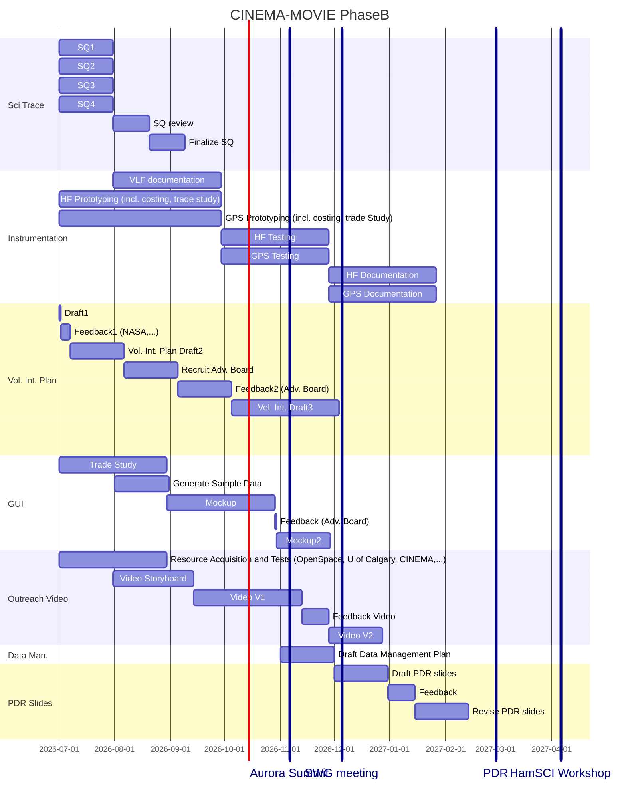

```mermaid
gantt
    title  CINEMA-MOVIE PhaseB
    dateFormat YYYY-MM-DD
    section Sci Trace
        SQ1    :SQ1, 2026-07-01, 30d
        SQ2    :SQ2, 2026-07-01, 30d
        SQ3    :SQ3, 2026-07-01, 30d
        SQ4    :SQ4, 2026-07-01, 30d
        SQ review    :SQreview, after SQ4, 20d
        Finalize SQ :SQrevision, after SQreview, 20d
        SWG meeting :vert, v1, 2026-12-05, 0d


    section Instrumentation
        VLF documentation    :VLF, after SQ3, 60d
        HF Prototyping (incl. costing, trade study)    :HF, 2026-07-01, 90d
        GPS Prototyping (incl. costing, trade Study)   :GPS, 2026-07-01, 90d
        HF Testing  :HFtest, after HF, 60d
        GPS Testing :GPStest, after GPS, 60d
        HF Documentation    :HFdoc, after HFtest, 60d
        GPS Documentation   :GPSdoc, after GPStest, 60d


    section Vol. Int. Plan
        Draft1	:Draft1, 2026-07-01, 1d
        Feedback1 (NASA,...) :Feedback1, after Draft1, 5d
        Vol. Int. Plan Draft2 	:Draft2, after Feedback1, 30d
        Recruit Adv. Board	:Board, after Draft2, 30d
        Feedback2 (Adv. Board) :Feedback2, after Board, 30d
        Vol. Int. Draft3 :Draft3, after Feedback2, 60d
        Aurora Summit   :vert, v1, 2026-11-06, 0d
        HamSCI Workshop :vert, v1, 2027-04-06, 0d


    section GUI
 	    Trade Study	:TradeStudy, 2026-07-01, 60d
	    Generate Sample Data	:SampleData, 2026-08-01, 30d
        Mockup	:Mockup, after TradeStudy, 60d
        Feedback (Adv. Board)	:MockupFeedback, after Mockup, 1d
        Mockup2	:Mockup2, after MockupFeedback, 30d	


    section Outreach Video
        Resource Acquisition and Tests (OpenSpace, U of Calgary, CINEMA,...) :Resource, 2026-07-01, 60d
        Video Storyboard  :Storyboard, after SQ1, 45d
        Video V1   :VideoV1, after Storyboard, 60d
        Feedback Video  :VideoFeedback, after VideoV1,15d
        Video V2    :VideoV2, after VideoFeedback, 30d


    section Data Man.
        Draft Data Management Plan	:DataPlan, 2026-11-01, 30d


    section PDR Slides
	    Draft PDR slides	:PDR, 2026-12-01, 30d
	    Feedback	:PDRfeedback, after PDR, 15d
	    Revise PDR slides	:PDR2, after PDRfeedback, 30d
        PDR :vert, v1, 2027-03-01, 0d
```
